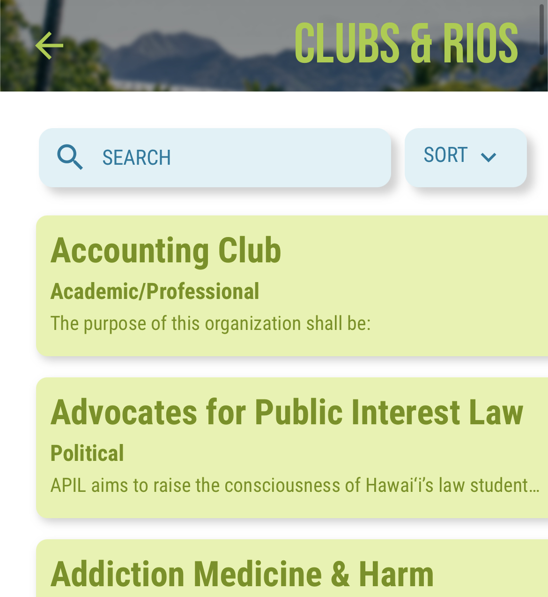

<div class="text-center p-4">
  
</div>

The Manoa Now app is a mobile application that serves as a highly useful tool for students at the University of Hawaii at Manoa to stay connected and informed. It provides a comprehensive set of features for students to access all essential information, including events, campus security, and more.

For this project, I was responsible for programming the club page on the Manoa Now app based on a provided design. I began by working with the existing code from similar pages. From there, I proceeded to create various features for the club page, such as filtering and searching for different clubs by their names and categories. After completing the programming and testing phases, the club page was successfully implemented into the Manoa Now app.

From this experience, I learned a lot. It was my frist time doing any sort of project and learning a new programming language. From this project, I gained a solid foundation for my future projects and developed myself professional as well. The lessons I learned from this project span far beyond progammings, as I learned about time management and teamwork. 
```

You can learn more on the Manoa Now App or at [Manoa Now](https://www.manoanow.org/).
